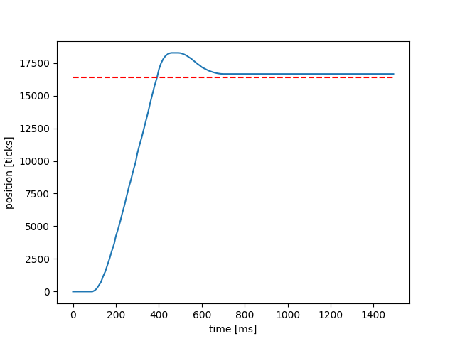

# ME405 Lab 3: On Schedule

## Scheduling Experiments

The purpose of this lab is to run tasks simultaneously using a real time scheduler. The main goal is to get proper multitasking
between multiple motors using previous lab assignments. We're able to run more than one motor at once in combination with our generic 
controller from Lab 2. As we run these experiments, we're interested in running the tasks at slower and slower rates until the response
of the motors is noticeably delayed, and affects the controller performance. Below are two step response plots that show the tasks running
at a relatively fast rate of 10ms, and then we can see when the tasks are running at a rate of 100ms, the step response is noticeably worse
and does not reach the set point efficiently.

## Step Response Plots
|  |
|:--:|
|**Figure 1: KP = 0.3, Task Run Rate = 10ms**|

|  |
|:--:|
|**Figure 2: KP = 0.9, Task Run Rate = 50ms**|

|  |
|:--:|
|**Figure 3: KP = 0.9, Task Run Rate = 100ms**|